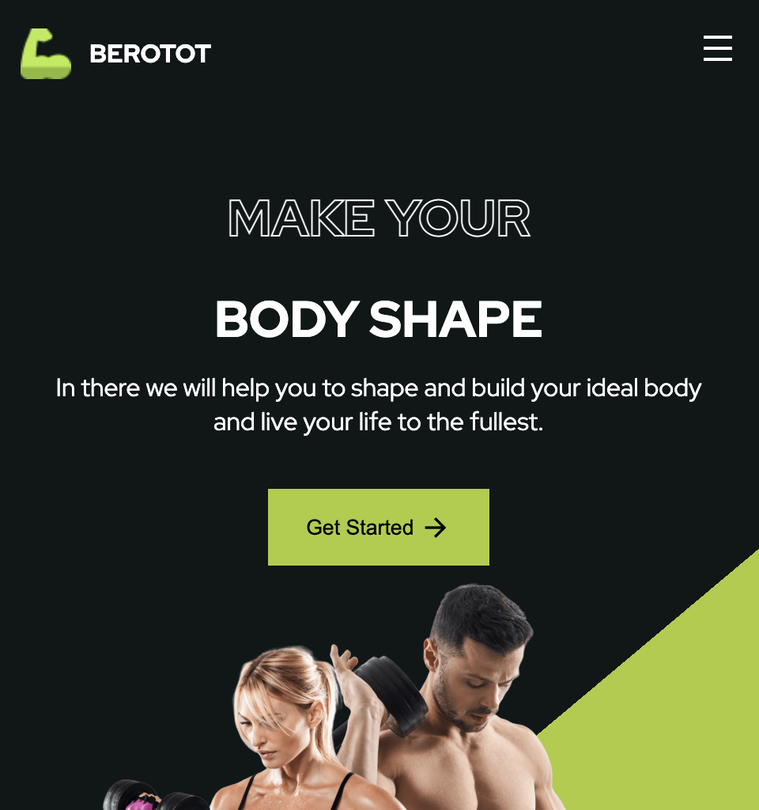

# responsive-gym-website

**專案靈感來自於[Bedimcode](https://youtu.be/ddaY0rHqMxM)的影片**

參考UI並自己刻出內容

- [Demo](https://connectshark.github.io/responsive-gym-website/index.html)

## 專案內容

- 多樣html tag(form, input, aside, button, header)
- modren css(grid, flex, :not())
- 使用CSS變數
- 使用script defer功能
- 捲動事件偵測(IntersectionObserver API)
- 串接emailJS內容前端發送email(目前是寄至作者信箱)